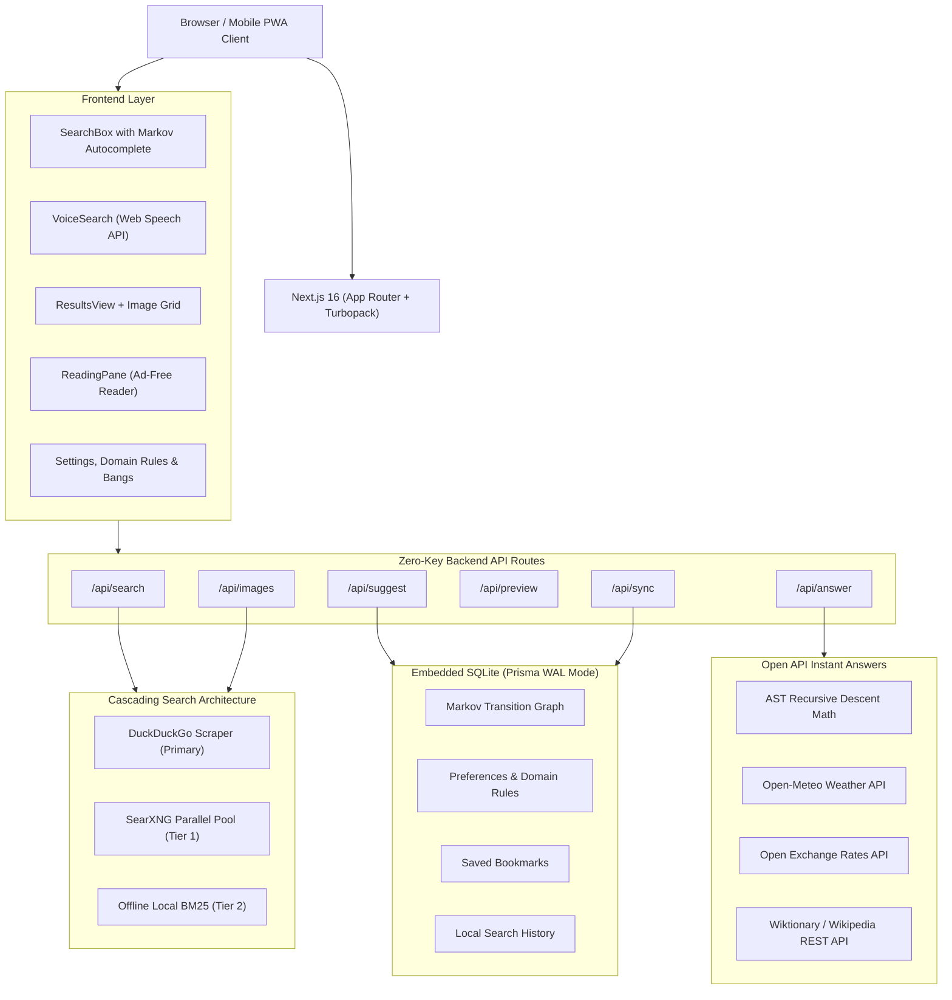

# WHITE Search

<div align="center">

```text
  ██╗    ██╗██╗  ██╗██╗████████╗███████╗
  ██║    ██║██║  ██║██║╚══██╔══╝██╔════╝
  ██║ █╗ ██║███████║██║   ██║   █████╗  
  ██║███╗██║██╔══██║██║   ██║   ██╔══╝  
  ╚███╔███╔╝██║  ██║██║   ██║   ███████╗
   ╚══╝╚══╝ ╚═╝  ╚═╝╚═╝   ╚═╝   ╚══════╝
            S  E  A  R  C  H
```

**The world's cleanest, privacy-first search engine.**  
*No ads. No sponsors. No tracking. Powered by Markov chains and the open web.*  
*Internet of the people, by the people, for the people.*

[](LICENSE)
[](https://nextjs.org/)
[](https://www.typescriptlang.org/)
[](https://tailwindcss.com/)
[](Dockerfile)
[](CONTRIBUTING.md)

</div>

---

## The Philosophy

Modern web search is broken. Results pages have devolved into walls of sponsored links, SEO spam farms, invasive tracking cookies, and banners that bury honest answers beneath the fold.

**WHITE Search** was designed from the ground up to restore the web to its purest, most transparent form:
- **WHITE = Clean, pristine, unobstructed, and transparent** *(white as a blank canvas and clean aesthetic, completely free from visual and algorithmic clutter)*.
- **100% Ad-Free**: Zero sponsored results, zero affiliate redirects, zero monetization dark patterns.
- **Zero Tracking**: No user tracking, no device fingerprinting, no behavioral profiling. Session state is keyed to an anonymous UUID stored solely in your own browser cookies.
- **Markov Chain Autocomplete**: Autocomplete queries learn transparently on your device via SQLite Markov transition graphs, rather than harvesting your personal queries to private corporate cloud silos.
- **100% Open Source (MIT)**: Pure open-source architecture with **zero proprietary SDKs** or paid API requirements. Self-hostable anywhere with one command.

---

## Key Features

### 🔍 Multi-Tier Cascading Metasearch
- **DuckDuckGo Engine**: Privacy-preserving web results with zero API keys required.
- **SearXNG Failover Pool**: Decentralized open-source metasearch with parallel instance racing.
- **Offline BM25 Knowledge Engine**: Local search engine capable of answering queries completely offline when disconnected from the internet.

### 🖼️ Blazing Fast Image Search
- Multi-source parallel image pipeline querying DuckDuckGo Image Service, Wikimedia Commons Open API, and SearXNG instances concurrently.
- Delivers 40–80 high-resolution images in **<1.2 seconds** with dimensions, sources, and full-screen lightbox previews.

### ⚡ Deterministic Instant Answers
- **Safe Calculator & Math**: Full AST recursive descent evaluator without unsafe `eval()` (`2+2`, `sqrt(144)`, `sin(pi/2)`, `15% of 80`).
- **Unit Conversions**: Live metric and imperial conversions (`100 km in miles`, `72 f to c`, `5 kg in lbs`).
- **Live Weather**: Instant global weather via Open-Meteo (`weather in tokyo`, `weather in new york`).
- **Live Currency Exchange**: Real-time currency conversions via Open Exchange Rates (`100 usd in eur`, `50 gbp in jpy`).
- **Instant Dictionary**: Concise word definitions via Wiktionary & Wikipedia REST APIs (`define serendipity`).

### 📖 Distraction-Free Reading Mode
- Convert any search result into a clean, typography-focused reading view with one click.
- Extracts main article text, generates instant markdown summaries, and strips ads, banners, and paywall popups.

### 🛡️ Kagi-Inspired Domain Rules
- **Raise (+)**: Boost your favorite high-quality domains in future search results.
- **Lower (-)**: Demote low-effort content farms and clickbait sites.
- **Block (x)**: Completely purge spam domains from all searches.

### 🚀 DuckDuckGo-Style Bangs
- Over 30 built-in shortcuts (`!w` Wikipedia, `!gh` GitHub, `!yt` YouTube, `!so` StackOverflow, `!mdn` MDN, `!r` Reddit) plus custom user-defined bangs configured in the Settings Sheet.

### 🎙️ Native Voice Search
- Browser-native Web Speech API integration for instant, zero-latency voice searches across Chrome, Edge, Safari, and Android with zero audio uploaded to third-party servers.

### 🎨 11 Curated Themes & Custom Accents
- Minimalist palette inspired by natural paper tones: Pure, Ivory, Snow, Pearl, Alabaster, Ghost, Seashell, Mint, Midnight, Charcoal, Slate, plus custom hex accents.

### ⌨️ Keyboard-First Vim-Style Navigation
- Navigate the entire web without touching your mouse: `j`/`k` to select results, `Enter` to open, `r` for reader view, `/` to search, `?` for shortcuts help.

### 📱 Progressive Web App (PWA)
- Installable on iOS, Android, macOS, and Windows with offline caching.

---

## Quickstart

### Option 1: Docker (Recommended for Self-Hosting)

Run WHITE Search with Docker Compose in one command:

```bash
docker compose up -d
```

Open [http://localhost:3000](http://localhost:3000) in your browser.  
Your database and user rules are automatically persisted in `./db/custom.db`.

---

### Option 2: Local Development

#### Prerequisites
- **Node.js**: v20.x or v22.x LTS (or **Bun** 1.1+)
- **Package Manager**: `pnpm` (recommended), `npm`, or `bun`

#### Installation

1. **Clone the repository**:
   ```bash
   git clone https://github.com/white-search/white-search.git
   cd white-search
   ```

2. **Install dependencies**:
   ```bash
   pnpm install
   # or: npm install
   ```

3. **Initialize database schema**:
   ```bash
   cp .env.example .env
   pnpm db:setup
   # or: npm run db:setup
   ```

4. **Start the development server**:
   ```bash
   pnpm dev
   # or: npm run dev
   ```

5. Visit [http://localhost:3000](http://localhost:3000).

---

## Architecture Overview



---

## Search Operators Reference

| Operator | Syntax | Description | Example |
| :--- | :--- | :--- | :--- |
| **Exact Match** | `"..."` | Matches exact phrase | `"distributed consensus"` |
| **Site Filter** | `site:` | Restricts results to a domain | `site:github.com nextjs` |
| **File Type** | `filetype:` or `ext:` | Filters by document extension | `filetype:pdf machine learning` |
| **Exclude Term** | `-term` | Excludes pages containing term | `recipes -pinterest` |
| **Bangs** | `!prefix` | Direct redirects to external sites | `!w Nikola Tesla` or `!gh vercel/next.js` |

---

## Built-in Bangs Directory

| Bang | Destination | Category |
| :--- | :--- | :--- |
| `!w` or `!wiki` | Wikipedia | Knowledge |
| `!gh` | GitHub | Development |
| `!so` | Stack Overflow | Development |
| `!yt` | YouTube | Media |
| `!r` | Reddit | Media |
| `!mdn` | Mozilla Developer Network | Development |
| `!npm` | npm Packages | Development |
| `!pypi` | Python Package Index | Development |
| `!arxiv` | arXiv Scientific Papers | Reference |
| `!wa` | Wolfram\|Alpha | Knowledge |
| `!m` | Google Maps | Navigation |
| `!osm` | OpenStreetMap | Navigation |
| `!hn` | Hacker News | Tech |
| `!dev` | DEV Community | Tech |

*Add your own custom bangs in the Settings Sheet (e.g. `!custom http://example.com/search?q={{{s}}}`).*

---

## Keyboard Shortcuts

| Key | Action |
| :--- | :--- |
| `/` | Focus search input |
| `Esc` | Clear query / return to home view |
| `j` / `Down` | Move down to next search result |
| `k` / `Up` | Move up to previous search result |
| `Enter` | Open selected result |
| `b` | Toggle bookmark on focused result |
| `r` | Open distraction-free Reading View |
| `?` | Open Keyboard Shortcuts Help |
| `g` then `h` | Go to Home view |
| `g` then `s` | Open Settings |
| `g` then `b` | Open Bookmarks |
| `g` then `m` | Open Markov Transparency Inspector |

---

## Environment Variables

| Variable | Default | Description |
| :--- | :--- | :--- |
| `DATABASE_URL` | `file:../db/custom.db` | SQLite database file location |
| `PORT` | `3000` | Port for the HTTP server |
| `DEFAULT_SEARCH_PROVIDER` | `ddg` | Primary search provider (`ddg`, `searxng`, `local`) |
| `SEARXNG_INSTANCE` | `https://searx.be` | Preferred SearXNG instance URL |
| `OPENAI_API_KEY` | *(Optional)* | API key for optional LLM summaries |
| `OPENAI_BASE_URL` | *(Optional)* | Custom base URL for Ollama / Groq / LocalAI |
| `OPENAI_MODEL` | `gpt-4o-mini` | Model name for generative summaries |

---

## Public Deployment Guide

### Deploy to Docker / VPS
```bash
docker run -d \
  --name white-search \
  -p 3000:3000 \
  -v white_data:/app/db \
  --restart unless-stopped \
  white-search:latest
```

### Deploy to CapRover / Coolify
Use the included `Dockerfile` and set persistent volume storage to `/app/db`.

### Deploy to Vercel
1. Fork this repository.
2. Import the project in Vercel.
3. Set `DATABASE_URL="file:/tmp/custom.db"` (or connect Turso / libSQL for persistent serverless SQLite).
4. Deploy!

---

## Security & Privacy Guarantee

- **Zero-Log Policy**: Search queries are never sent to third-party ad networks or tracking servers.
- **SSRF Safeguards**: All external fetching for reading previews and custom bangs is filtered through `src/lib/security.ts` to block internal network access and metadata injection.
- **In-Memory Rate Limiting**: Embedded sliding-window rate limiters prevent scraping and denial-of-service abuse.
- **Strict Headers**: Strict Content Security Policies, `X-Frame-Options: DENY`, and HTTPS transport headers enabled by default.

---

## Contributing

WHITE Search is a community-driven project. We welcome pull requests, bug reports, and suggestions!

- Please read our [CONTRIBUTING.md](CONTRIBUTING.md) for local setup, PR guidelines, and architectural details.
- Review our [CODE_OF_CONDUCT.md](CODE_OF_CONDUCT.md) to understand community standards.

---

## License

WHITE Search is open-source software licensed under the [MIT License](LICENSE).  
Feel free to use, fork, modify, and host your own instance.
